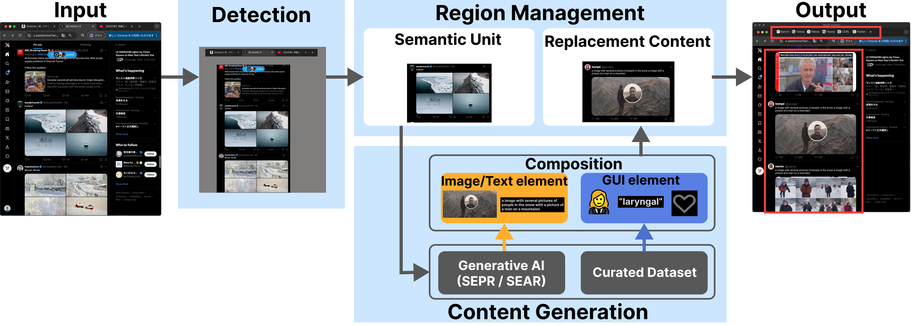

# ScreenRecompose: Screen Privacy Protection System Using Generative Content Replacement

## Overview

This system is designed to protect private information during screen sharing by detecting sensitive regions on the screen and replacing them with visually plausible, semantically related generated content.

Rather than simply hiding private information with masks or blur, the system aims to preserve the visual context of the shared screen while reducing the risk of exposing private information. The current implementation continuously captures a Chrome window in real time, processes the captured screen content, and displays a newly generated replacement window with replaced content.

## Demo


## Features

- Real-time screen privacy protection
- Real-time screen capture and private information detection
- Generative AI-based semantic-aware content replacement
- Scroll-aware region management
- Asynchronous client-server generation pipeline
- Cached overlay reuse

## System Pipeline

1. Capture live screen content
2. Detect private regions
3. Manage regions based on detection labels
4. Generate replacement content asynchronously
5. Render the processed screen in real time



## Directory Structure

```text
project/
├── README.md
├── requirements.txt
├── assets/
└── src/
    ├── main.py        # Main entry point
    ├── paths.py       # Path configuration
    ├── detection/     # Screen capture and private information detection
    ├── generation/    # Client-side replacement content handling
    ├── regions/       # Region management and label-specific rules
    ├── rendering/     # Overlay-based screen rendering
    └── server/        # Server-side content generation API
```

## Requirements

- Python 3.10+
- macOS recommended
- Apple Silicon MacBook Pro recommended for stable real-time processing
- GPU recommended for image generation (e.g., RTX 4090)

## Models

The system was developed using the following models:

- YOLOv5-based private information detector
- BLIP-2
- SDXL Turbo

## External Resources

This project uses the following external resources:

- EOWL-v1.1.2
- OpenMoji (openmoji-72x72-color)

## Notes

- This repository provides a partial research prototype implementation.
- Detection and generation models are not included in this repository.
- The current public version supports only the Amazon top page used in the demo environment.

## Related Publications

* UIST 2025
  *Context-Preserving Content Replacement for Privacy Protection in Screen Sharing with Generative AI*
  https://dl.acm.org/doi/10.1145/3746058.3758442

* ACM ISS 2026
  Accepted paper (to appear)
